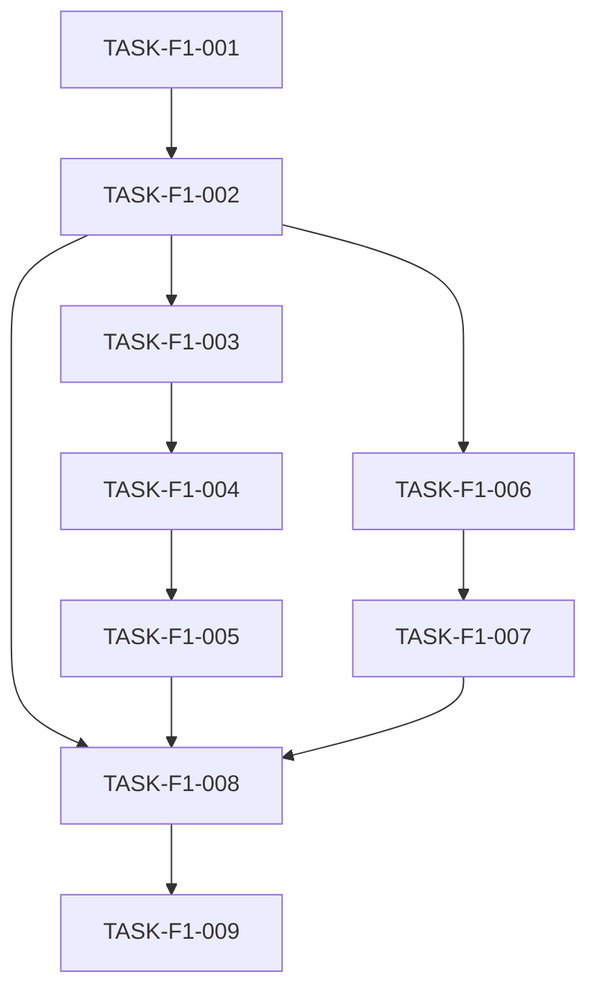

# Tasks: FASE-1 - Mini

> **Input:** plan/fases/FASE-1-mini.md + plan/fase-plans/PLAN-FASE-1.md
> **Generated:** 2026-08-24
> **Total tasks:** 9
> **Parallel capacity:** 2
> **Critical path:** 7 tasks

---

## Summary

| Metric | Value |
|--------|-------|
| Total tasks | 9 |
| Parallelizable | 4 (44%) |
| Work Streams | 2 (A: 3 tasks, B: 2 tasks) |
| Setup phase | 1 tasks |
| Foundation phase | 1 tasks |
| Domain phase | 2 tasks |
| Contract phase | 3 tasks |
| Integration phase | 1 tasks |
| Test phase | 0 tasks |
| Verification phase | 1 tasks |

## Traceability

| Spec Reference | Task Coverage |
|---------------|---------------|
| UC-001 | TASK-F1-003, TASK-F1-004, TASK-F1-005, TASK-F1-008 |
| UC-002 | TASK-F1-006, TASK-F1-007, TASK-F1-008 |
| ADR-001 | TASK-F1-001, TASK-F1-002 |
| INV-SYS-001 | TASK-F1-003 |

---

## Phase 1: Setup

**Purpose:** Project structure, dependencies, configuration.
**Checkpoint:** Project initializes and builds successfully.

- [ ] TASK-F1-001 Initialize package manifest | `package.json`
  - **Commit:** `chore(bootstrap): initialize package manifest`
  - **Acceptance:**
    - `type: module`; scripts `build` (`tsc`), `test` (`node --test`), `start` (PLAN-FASE-1 §4.1)
    - TypeScript is the only devDependency; no runtime dependencies (ADR-001)
  - **Refs:** FASE-1, ADR-001
  - **Revert:** CONFIG — nothing builds without the manifest
  - **Review:**
    - [ ] Scripts match PLAN-FASE-1 §4.1
    - [ ] No secrets in the manifest

---

## Phase 2: Foundation

**Purpose:** Shared infrastructure blocking all subsequent phases.
**Checkpoint:** Foundation services pass smoke tests.

- [ ] TASK-F1-002 Create entry point with `main()` bootstrap | `src/index.ts`
  - blocked-by: TASK-F1-001
  - **Commit:** `feat(bootstrap): add entry point with main() bootstrap`
  - **Acceptance:**
    - Exports `main(argv: string[]): Promise<number>` returning `0` (PLAN-FASE-1 §4.2)
    - Runs `main()` when executed directly and exits with its return code
  - **Refs:** FASE-1, ADR-001
  - **Revert:** SAFE — no entry point; API and CLI cannot start
  - **Review:**
    - [ ] Code compiles without errors
    - [ ] No import from `src/api/` or `src/cli/` yet (wired in TASK-F1-008)

---

## Phase 3: Domain

**Purpose:** Entities, value objects, domain logic.
**Checkpoint:** Domain model unit tests pass.

- [ ] TASK-F1-003 [P] Create HealthStatus value object | `src/api/health-status.ts`
  - blocked-by: TASK-F1-002
  - **Commit:** `feat(api): add HealthStatus value object`
  - **Acceptance:**
    - `healthStatus()` returns `{ status: "ok", uptime }` with `uptime >= 0` (INV-SYS-001)
    - `uptime` derived from `process.uptime()` (PLAN-FASE-1 §4.3)
  - **Refs:** FASE-1, UC-001, INV-SYS-001
  - **Revert:** SAFE — health handler has no payload
  - **Review:**
    - [ ] Follows ubiquitous language (`HealthStatus`)
    - [ ] INV-SYS-001 enforced (no negative uptime)

- [ ] TASK-F1-006 [P] Create CLI argument parser | `src/cli/args.ts`
  - blocked-by: TASK-F1-002
  - **Commit:** `feat(cli): add argument parser`
  - **Acceptance:**
    - `parseArgs(argv)` returns `{ command: "ping" }` for `ping`, `{ command: "help" }` for `--help` or no args (PLAN-FASE-1 §4.6)
    - Unknown command → `{ command: "help" }` with exit code 1 requested
  - **Refs:** FASE-1, UC-002
  - **Revert:** SAFE — CLI cannot parse commands
  - **Review:**
    - [ ] Code compiles without errors
    - [ ] `--help` output lists `ping`

---

## Phase 4: Contracts

**Purpose:** API endpoints, event schemas, handlers.
**Checkpoint:** Contract tests pass against spec.

- [ ] TASK-F1-004 [P] Implement GET /health handler | `src/api/health.ts`
  - blocked-by: TASK-F1-003
  - **Commit:** `feat(api): implement GET /health handler`
  - **Acceptance:**
    - `GET` → `200` with JSON `healthStatus()` (UC-001)
    - Any other method → `405` (PLAN-FASE-1 §4.4)
  - **Refs:** FASE-1, UC-001
  - **Revert:** SAFE — router has no handler for `/health`
  - **Review:**
    - [ ] Response matches `contracts/API-health.md`
    - [ ] Content-Type is `application/json`

- [ ] TASK-F1-005 Create API router | `src/api/router.ts`
  - blocked-by: TASK-F1-004
  - **Commit:** `feat(api): add router mapping GET /health`
  - **Acceptance:**
    - `createRouter()` maps `GET /health` to the handler (PLAN-FASE-1 §4.5)
    - Unknown paths → `404`
  - **Refs:** FASE-1, UC-001
  - **Revert:** SAFE — server cannot route requests
  - **Review:**
    - [ ] Code compiles without errors
    - [ ] No import from `src/cli/`

- [ ] TASK-F1-007 [P] Implement `ping` command | `src/cli/ping.ts`
  - blocked-by: TASK-F1-006
  - **Commit:** `feat(cli): implement ping command`
  - **Acceptance:**
    - Prints `pong` to stdout and returns `0` (UC-002)
  - **Refs:** FASE-1, UC-002
  - **Revert:** SAFE — `ping` command unavailable
  - **Review:**
    - [ ] Code compiles without errors
    - [ ] No import from `src/api/`

---

## Phase 5: Integration

**Purpose:** Wiring, event handlers, cross-cutting concerns.
**Checkpoint:** Integration tests pass.

- [ ] TASK-F1-008 Wire API router and CLI into entry point | `src/index.ts`
  - blocked-by: TASK-F1-002, TASK-F1-005, TASK-F1-007
  - **Commit:** `feat(bootstrap): wire API router and CLI into main()`
  - **Acceptance:**
    - With a CLI command, `main()` runs it and returns its exit code (UC-002)
    - Without arguments, `main()` starts `node:http` on port 3000 with `createRouter()` (UC-001, PLAN-FASE-1 §4.8)
  - **Refs:** FASE-1, UC-001, UC-002, ADR-001
  - **Revert:** COUPLED — reverts to the bootstrap stub of TASK-F1-002; API and CLI unreachable
  - **Review:**
    - [ ] Only file importing from both `src/api/` and `src/cli/`
    - [ ] Exit code propagated from the command

---

## Phase 6: Tests

**Purpose:** Remaining test coverage (BDD, property, e2e).
**Checkpoint:** All test suites green.

No tasks: every source file is verified end to end by TASK-F1-009 (see Test Exclusions).

### Test Exclusions

Files excluded from unit test coverage (from PLAN-FASE §7.4 Exclusions):

| File | Reason | Verified By |
|------|--------|-------------|
| `src/api/health-status.ts` | tested via E2E | TASK-F1-009 (`curl /health`) |
| `src/api/health.ts` | tested via E2E | TASK-F1-009 (`curl /health`) |
| `src/api/router.ts` | tested via E2E | TASK-F1-009 (`curl /health`) |
| `src/cli/args.ts` | tested via E2E | TASK-F1-009 (`node dist/index.js ping`) |
| `src/cli/ping.ts` | tested via E2E | TASK-F1-009 (`node dist/index.js ping`) |
| `src/index.ts` | infrastructure wrapper (bootstrap) | N/A - infrastructure |

---

## Phase 7: Verification

**Purpose:** End-to-end validation against FASE Criterios de Exito.
**Checkpoint:** All FASE acceptance criteria verified.

- [ ] TASK-F1-009 Verify all FASE-1 Criterios de Exito
  - blocked-by: TASK-F1-008
  - **Commit:** `test(mini): verify FASE-1 acceptance criteria`
  - **Acceptance:** All 4 criteria from FASE-1 marked as verified (`curl /health`, `ping`, `--help`, build + test green)
  - **Refs:** FASE-1
  - **Revert:** SAFE
  - **Review:**
    - [ ] All criteria checked
    - [ ] Evidence documented

---

## Dependencies

### Task Dependency Graph

### Critical Path

1. TASK-F1-001 → TASK-F1-002 → TASK-F1-003 → TASK-F1-004 → TASK-F1-005 → TASK-F1-008 → TASK-F1-009
   (7 tasks on critical path)

### Parallel Execution Plan

**Stream A:** HTTP surface (`src/api/**`) — see Stream Ownership
**Stream B:** CLI (`src/cli/**`) — see Stream Ownership

## Stream Ownership

| Stream | Tasks | Owns (write-set) | Runs in |
|--------|-------|------------------|---------|
| base | TASK-F1-001, TASK-F1-002 | package.json, src/index.ts | main checkout, before worktrees (checkpoint `fase-1-foundation`) |
| A | TASK-F1-003, TASK-F1-004, TASK-F1-005 | src/api/** | worktree `feat/fase-1-a` |
| B | TASK-F1-006, TASK-F1-007 | src/cli/** | worktree `feat/fase-1-b` |
| integración | TASK-F1-008 | src/index.ts | main checkout, after `--integrate --fase 1` |
| verificación | TASK-F1-009 | — | main checkout, Phase 9 |

### Rollback Checkpoints

| Checkpoint | After Task | Tag | Runs in |
|-----------|------------|-----|---------|
| Foundation | TASK-F1-002 | `fase-1-foundation` | main checkout |
| Verified | TASK-F1-009 | `fase-1-verified` | main checkout |
